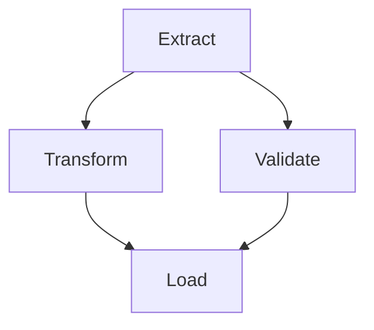
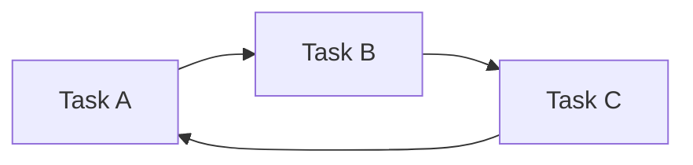

# Weaver (Currently WIP)
A learning project, for me to gain a better understanding of these technologies.

A DAG-based job scheduler and workflow orchestrator. Weaver lets you define workflows as directed acyclic graphs of tasks, schedule them, execute them across a pool of workers, and recover automatically when things fall. Think of it as small, readable, from-scratch take on the ideas behind Airflow and Temporal.

The name is based on a loom. A workflow is a set of threads (tasks) woven together into something coherent, with each pass depending on the ones before it.

## Why this exists

Weaver is built to exercise the harder, more interesting problems that show up once you taken execution reliability seriously. They are:

- At-lease-once execution with idempotency, so a retried task does not corrupt state.
- Dead worker detection via hearrbeats and lease expiry, so a crashed worker does not strand its work.
- Dependency resolution across a DAG, so tasks only run once their upsteams succeed.
- Retries with exponential backoff and timeouts, so transient failures self-heal.
- A queue that survives restarts, back by Postgres rather than in-memory state.

## Understanding DAGS

DAG stands for Directed Acyclic Graph. It is the concept the entire project is build a round, so it is worth taking the time to understand before doing anything else. Break the name into its three parts:

- Graph: A set of nodes connected by edges. In Weaver, each node is a task ("extract data", "send email") and each edge is a dependency between tasks.
- Directed: The edges have a direction. "Transform" depends on "extract", and that arrow only points one way. Extract has to finish before transform can start, never     the reverse.
- Acyclic: There are no cycles. You can never follow the arrows and end up back where you started. This is a crucial property.

A valid DAG has arrows that only ever flow forward.

A graph with a cycle is not a DAG, and a scheduler cannot run it. Below, A waits on C, C waits on B, and B waits on A. Nothing can ever start, because every task is blocked by another task that is itself blocked.

## Why acyclic matters

The acyclic property is what makes the whole system computable. Because there are no cycles, two things are always true:

1. You an always find a valid order to run the tasks. This ordering is called a `topological sort`, and there can more than one valid ordering. This is exactly what lets independent tasks (like "transform" and "validate" above) run in parallel.
2. You can always answer "what is ready to run right now?" by checking whether every task pointing into a given task has already succeeded.

The worker loop is essentially:
- Find tasks whose upstream dependencies are all done.
- Run the tasks.
- Mark the tasks as complete.
- Repeat. The algorithm only terminates because the graph is acyclic.

Because of this, one of the first things Weaver does when a worklow is submitted is validate that it is actually a DAG, rejecting any definition that contains a cycle before it ever tries to run. Cycle detection is a classic depth-first-search problem.

## Glossary

- `Node` (or vertex): a single task.
- `Edge`: a dependency arrow between two tasks.
- `Upstream`: the tasks that must finish before a given task can run ("extract" is upstream of "transform").
- `Downstream`: the tasks waiting on a given task to finish.
- `Root task`: a task with no upstream dependencies. These are what the scheduler kicks off first when a run starts.
- `Topological` sort: any ordering of the tasks that respects all the dependency arrows.
