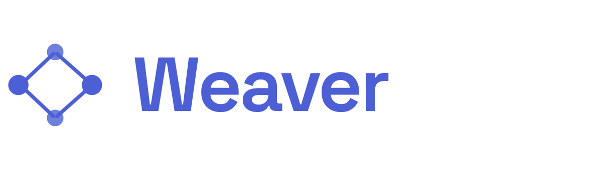
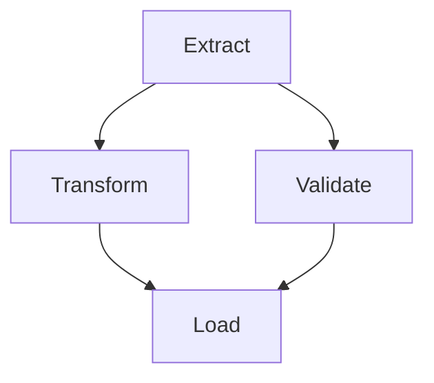
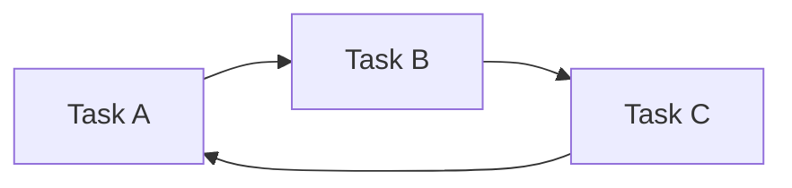
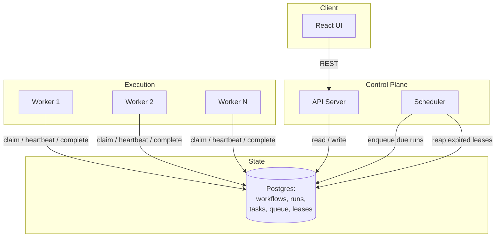
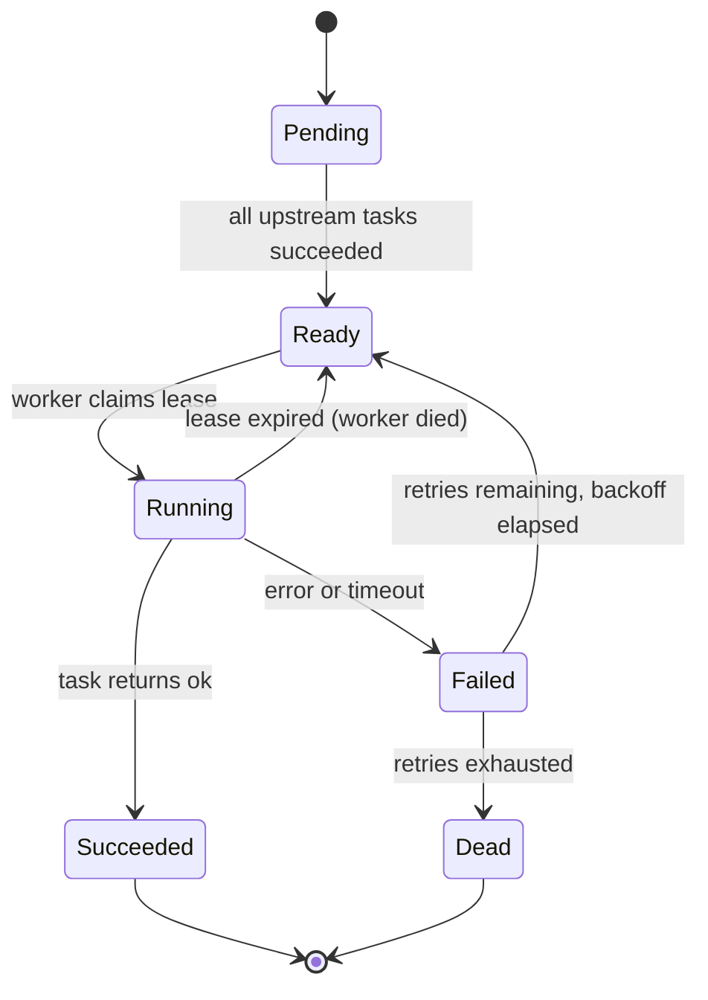
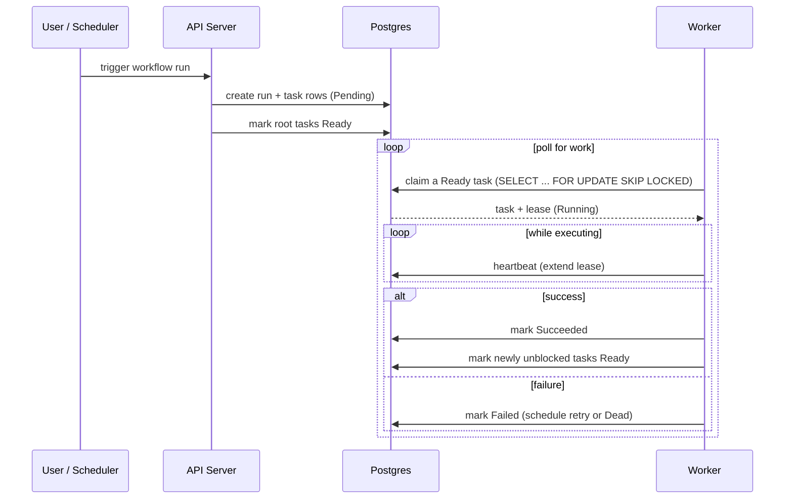

<!-- Add the wordmark image at docs/branding/weaver-wordmark.png and it will render here. A transparent PNG around 600px wide works well on both light and dark themes. -->
<p align="center">
  
</p>

A DAG-based job scheduler and workflow orchestrator. Weaver lets you define workflows as directed acyclic graphs of tasks, schedule them, execute them across a pool of workers, and recover automatically when things fall. Think of it as small, readable, from-scratch take on the ideas behind Airflow and Temporal.

## Why this exists

Weaver is built to exercise the harder, more interesting problems that show up once you taken execution reliability seriously. They are:

- At-lease-once execution with idempotency, so a retried task does not corrupt state.
- Dead worker detection via hearrbeats and lease expiry, so a crashed worker does not strand its work.
- Dependency resolution across a DAG, so tasks only run once their upsteams succeed.
- Retries with exponential backoff and timeouts, so transient failures self-heal.
- A queue that survives restarts, back by Postgres rather than in-memory state.

## Understanding DAGS

DAG stands for Directed Acyclic Graph. It is the concept the entire project is build a round, so it is worth taking the time to understand before doing anything else. Break the name into its three parts:

- Graph: A set of nodes connected by edges. In Weaver, each node is a task ("extract data", "send email") and each edge is a dependency between tasks.
- Directed: The edges have a direction. "Transform" depends on "extract", and that arrow only points one way. Extract has to finish before transform can start, never     the reverse.
- Acyclic: There are no cycles. You can never follow the arrows and end up back where you started. This is a crucial property.

A valid DAG has arrows that only ever flow forward.



A graph with a cycle is not a DAG, and a scheduler cannot run it. Below, A waits on C, C waits on B, and B waits on A. Nothing can ever start, because every task is blocked by another task that is itself blocked.



## Why acyclic matters

The acyclic property is what makes the whole system computable. Because there are no cycles, two things are always true:

1. You an always find a valid order to run the tasks. This ordering is called a `topological sort`, and there can more than one valid ordering. This is exactly what lets independent tasks (like "transform" and "validate" above) run in parallel.
2. You can always answer "what is ready to run right now?" by checking whether every task pointing into a given task has already succeeded.

The worker loop is essentially:
- Find tasks whose upstream dependencies are all done.
- Run the tasks.
- Mark the tasks as complete.
- Repeat. The algorithm only terminates because the graph is acyclic.

Because of this, one of the first things Weaver does when a worklow is submitted is validate that it is actually a DAG, rejecting any definition that contains a cycle before it ever tries to run. Cycle detection is a classic depth-first-search problem.

## Glossary

- `Node` (or vertex): a single task.
- `Edge`: a dependency arrow between two tasks.
- `Upstream`: the tasks that must finish before a given task can run ("extract" is upstream of "transform").
- `Downstream`: the tasks waiting on a given task to finish.
- `Root task`: a task with no upstream dependencies. These are what the scheduler kicks off first when a run starts.
- `Topological` sort: any ordering of the tasks that respects all the dependency arrows.

## Features
 
- Define workflows as DAGs in JSON or via the API, with per-task dependencies.
- Cron-style scheduling plus manual and API-triggered runs.
- A worker pool that claims tasks using row-level locking (no double execution).
- Configurable retries, backoff, and per-task timeouts.
- Automatic recovery of tasks orphaned by dead workers.
- A React UI that renders the DAG, shows live run status, and exposes logs and run history.
- A REST API for triggering runs, inspecting state, and managing workflow definitions.
## Architecture
 
Weaver splits into four moving parts: an API server, a Postgres-backed store that doubles as the task queue, a pool of stateless workers, and a scheduler that turns time into work. The React UI talks only to the API server.
 

 
### Task lifecycle
 
Every task moves through a small, explicit state machine. Keeping the states minimal is what makes recovery tractable: a reaper only has to look for leases that expired while a task was RUNNING.
 

 
### Execution flow for a single run
 

 
## How the hard parts work
 
### At-least-once, not exactly-once
 
Weaver guarantees a task will run at least once. Exactly-once is not achievable in a distributed system without cooperation from the task itself, so tasks are expected to be idempotent. Each task execution carries a stable run ID and task ID that handlers can use as an idempotency key.
 
### Claiming work without double execution
 
Workers claim tasks with `SELECT ... FOR UPDATE SKIP LOCKED`. This lets many workers poll the same table concurrently while guaranteeing that any given task row is handed to exactly one worker at a time. No external lock service is required.
 
### Dead worker detection
 
When a worker claims a task it also writes a lease with an expiry timestamp, and it renews that lease with periodic heartbeats while the task runs. If the worker crashes, the heartbeats stop and the lease expires. A reaper (run by the scheduler) sweeps for RUNNING tasks whose lease has passed, and returns them to READY so another worker can pick them up. This is how a run resumes after a worker dies mid-task.
 
### Retries and timeouts
 
Each task has a max attempt count and a base backoff. On failure, Weaver computes the next eligible run time using exponential backoff with jitter, and the task will not be claimable again until that time passes. A task that exceeds its timeout is treated as a failure and follows the same path.
 
## Data model
 
The core tables (simplified):
 
- `workflows`: the DAG definition, versioned, stored as task nodes and edges.
- `runs`: one row per triggered execution of a workflow.
- `tasks`: one row per task per run, holding state, attempt count, timings, and result.
- `dependencies`: upstream and downstream edges for tasks within a run.
- `leases`: worker ID, task ID, and expiry for in-flight work.
Keeping the queue inside Postgres (rather than a separate broker) means one source of truth, transactional state transitions, and easy recovery. It trades some raw throughput for a much simpler correctness story, which is the right call for a system whose whole point is reliability.
 
## Tech stack
 
The backend is written in Go, split into three binaries (`cmd/api`, `cmd/scheduler`, `cmd/worker`) that share one database. Go is a natural fit here: goroutines make the worker pool and heartbeat loops cheap and easy to reason about, and each binary compiles to a single static file that is trivial to run and deploy.
 
- Language: Go (1.22 or newer).
- Postgres driver: `pgx` (`github.com/jackc/pgx`), which exposes the row-level locking and `SELECT ... FOR UPDATE SKIP LOCKED` behavior the queue relies on.
- Migrations: `golang-migrate` for versioned schema changes.
- HTTP: the standard library `net/http`, optionally with a lightweight router like `chi`. No heavy framework is needed.
- Cron parsing: `robfig/cron` for interpreting workflow schedules.
- Store and queue: Postgres, serving as both the durable store and the task queue.
- Frontend: React (scaffolded with Vite) plus a DAG rendering library such as React Flow for the graph view.
- Local dev: Docker Compose to bring up Postgres and one or more workers.

Deliberately not used: a separate message broker (Redis, RabbitMQ, Kafka) or an external lock service. Keeping the queue and locks inside Postgres is the whole point, since it gives transactional state transitions and one source of truth. Adding a broker later is a reasonable extension, not a starting requirement.

## Getting started
 
```bash
# clone and enter the project
git clone <your-repo-url> weaver
cd weaver
 
# start postgres, api, scheduler, and workers
docker compose up --build
 
# run database migrations
migrate -path ./migrations -database "$DATABASE_URL" up
 
# the UI is served at http://localhost:3000
# the API is served at http://localhost:8080
```
 
To scale workers locally, increase the replica count:
 
```bash
docker compose up --scale worker=4
```

## Screenshots
 
Screenshots of the UI go here once the frontend is built (Phase 8). Drop image files into a `docs/screenshots/` folder in the repo and update the paths in the table below.
 
| DAG view | Live run status | Run history |
| :---: | :---: | :---: |
|  |  |  |
| A workflow rendered as a graph | A run in progress, tasks colored by state | The run history and list view |
 
## API sketch
 
```
POST   /workflows              register or update a workflow definition
GET    /workflows              list workflows
POST   /workflows/:id/runs     trigger a run
GET    /runs/:id               fetch run status and task states
GET    /runs/:id/tasks/:tid    fetch a single task, including logs
POST   /runs/:id/cancel        cancel an in-flight run
```
 
## Example workflow definition
 
```json
{
  "name": "daily-report",
  "schedule": "0 6 * * *",
  "tasks": [
    { "id": "extract", "handler": "extractData", "retries": 3, "timeoutSeconds": 120 },
    { "id": "transform", "handler": "transformData", "dependsOn": ["extract"] },
    { "id": "load", "handler": "loadWarehouse", "dependsOn": ["transform"] },
    { "id": "notify", "handler": "sendEmail", "dependsOn": ["load"], "retries": 5 }
  ]
}
```
 
## Testing the failure paths
 
The parts worth proving out with tests or manual chaos:
 
- Kill a worker while a task is RUNNING and confirm the task is reclaimed after the lease expires.
- Trigger the same run twice and confirm idempotent handlers do not double-apply effects.
- Force a task to fail repeatedly and confirm backoff timing, then confirm it lands in DEAD after attempts are exhausted.
- Start many workers against a small queue and confirm no task is executed by two workers at once.

## Roadmap
 
- Sub-workflows and fan-out / fan-in patterns (dynamic task generation).
- A metrics endpoint exposing queue depth, run latency, and worker liveness.
- Pluggable handler runtimes so tasks can run as containers or remote calls.
- Priority queues and per-workflow concurrency limits.

## License

Released under the [MIT License](LICENSE). © 2026 SarahUniverse
