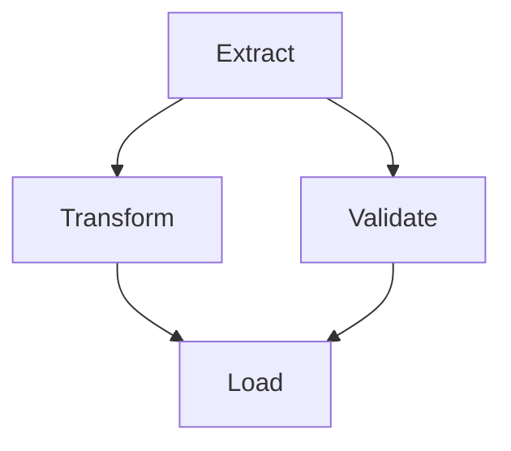
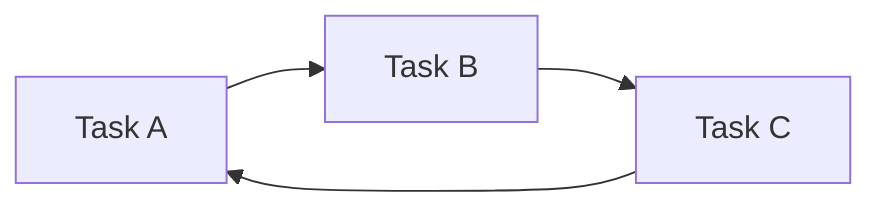
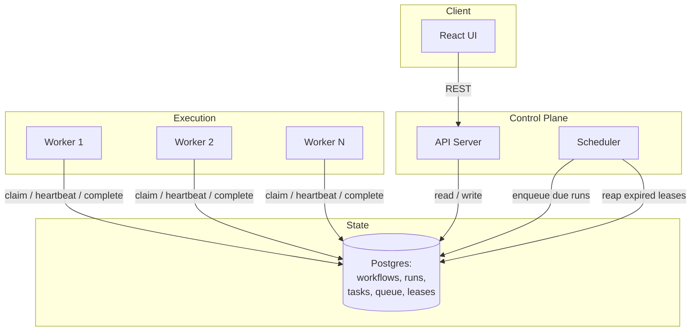
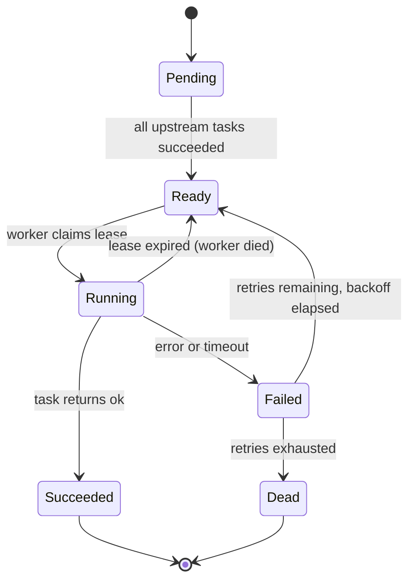
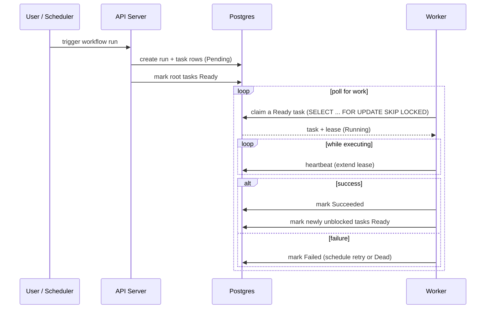

<p align="center">
  
</p>

Currently WIP

TODO: Add CI/CD with GitHub actions

A DAG-based job scheduler and workflow orchestrator. Weaver lets you define workflows as directed acyclic graphs of tasks, schedule them, execute them across a pool of workers, and recover automatically when things fail. Think of it as a small, readable, from-scratch take on the ideas behind Airflow and Temporal.

## Why this exists

Weaver is built to exercise the harder, more interesting problems that show up once you take execution reliability seriously. They are:

- At-least-once execution with idempotency, so a retried task does not corrupt state.
- Dead worker detection via heartbeats and lease expiry, so a crashed worker does not strand its work.
- Dependency resolution across a DAG, so tasks only run once their upstreams succeed.
- Retries with exponential backoff and timeouts, so transient failures self-heal.
- A queue that survives restarts, backed by Postgres rather than in-memory state.

## Understanding DAGS

DAG stands for Directed Acyclic Graph. It is the concept the entire project is built around, so it is worth taking the time to understand before doing anything else. Break the name into its three parts:

- Graph: A set of nodes connected by edges. In Weaver, each node is a task ("extract data", "send email") and each edge is a dependency between tasks.
- Directed: The edges have a direction. "Transform" depends on "extract", and that arrow only points one way. Extract has to finish before transform can start, never the reverse.
- Acyclic: There are no cycles. You can never follow the arrows and end up back where you started. This is a crucial property.

A valid DAG has arrows that only ever flow forward.


```mermaid
graph TD
Extract --> Transform
Extract --> Validate
Transform --> Load
Validate --> Load
```

A graph with a cycle is not a DAG, and a scheduler cannot run it. Below, A waits on C, C waits on B, and B waits on A. Nothing can ever start, because every task is blocked by another task that is itself blocked.


```mermaid
graph LR
A[Task A] --> B[Task B]
B --> C[Task C]
C --> A
```

## Why acyclic matters

The acyclic property is what makes the whole system computable. Because there are no cycles, two things are always true:

1. You can always find a valid order to run the tasks. This ordering is called a `topological sort`, and there can be more than one valid ordering. This is exactly what lets independent tasks (like "transform" and "validate" above) run in parallel.
2. You can always answer "what is ready to run right now?" by checking whether every task pointing into a given task has already succeeded.

The worker loop is essentially:
- Find tasks whose upstream dependencies are all done.
- Run the tasks.
- Mark the tasks as complete.
- Repeat. The algorithm only terminates because the graph is acyclic.

Because of this, one of the first things Weaver does when a workflow is submitted is validate that it is actually a DAG, rejecting any definition that contains a cycle before it ever tries to run. Cycle detection is a classic depth-first-search problem.

## Glossary

- `Node` (or vertex): A single task.
- `Edge`: A dependency arrow between two tasks.
- `Upstream`: The tasks that must finish before a given task can run ("extract" is upstream of "transform").
- `Downstream`: The tasks waiting on a given task to finish.
- `Root task`: A task with no upstream dependencies. These are what the scheduler kicks off first when a run starts.
- `Topological sort`: Any ordering of the tasks that respects all the dependency arrows.

## Features
 
- Defines workflows as DAGs in JSON or via the API, with per-task dependencies.
- Cron-style scheduling plus manual and API-triggered runs.
- A worker pool that claims tasks using row-level locking (no double execution).
- Configurable retries, backoff, and per-task timeouts.
- Automatic recovery of tasks orphaned by dead workers.
- A React UI that renders the DAG, shows live run status, and exposes logs and run history.
- A REST API for triggering runs, inspecting state, and managing workflow definitions.
## Architecture
 
Weaver splits into four moving parts: 
1. An API server
2. A Postgres-backed store that doubles as the task queue
3. A pool of stateless workers
4. A scheduler that turns time into work. The React UI talks only to the API server.
 

```mermaid
graph TB
    subgraph Client
        UI[React UI]
    end
 
    subgraph Control Plane
        API[API Server]
        SCH[Scheduler]
    end
 
    subgraph State
        DB[(Postgres:<br/>workflows, runs,<br/>tasks, queue, leases)]
    end
 
    subgraph Execution
        W1[Worker 1]
        W2[Worker 2]
        W3[Worker N]
    end
 
    UI -->|REST| API
    API -->|read / write| DB
    SCH -->|enqueue due runs| DB
    W1 -->|claim / heartbeat / complete| DB
    W2 -->|claim / heartbeat / complete| DB
    W3 -->|claim / heartbeat / complete| DB
    SCH -->|reap expired leases| DB
```
 
### Task lifecycle
 
Every task moves through a small, explicit state machine. Keeping the states minimal is what makes recovery tractable: a reaper only has to look for leases that expired while a task was RUNNING.
 

```mermaid
stateDiagram-v2
    [*] --> Pending
    Pending --> Ready: all upstream tasks succeeded
    Ready --> Running: worker claims lease
    Running --> Succeeded: task returns ok
    Running --> Failed: error or timeout
    Failed --> Ready: retries remaining, backoff elapsed
    Failed --> Dead: retries exhausted
    Running --> Ready: lease expired (worker died)
    Succeeded --> [*]
    Dead --> [*]
```
 
### Execution flow for a single run
 

```mermaid
sequenceDiagram
    participant U as User / Scheduler
    participant A as API Server
    participant D as Postgres
    participant W as Worker
 
    U->>A: trigger workflow run
    A->>D: create run + task rows (Pending)
    A->>D: mark root tasks Ready
    loop poll for work
        W->>D: claim a Ready task (SELECT ... FOR UPDATE SKIP LOCKED)
        D-->>W: task + lease (Running)
        loop while executing
            W->>D: heartbeat (extend lease)
        end
        alt success
            W->>D: mark Succeeded
            W->>D: mark newly unblocked tasks Ready
        else failure
            W->>D: mark Failed (schedule retry or Dead)
        end
    end
```
 
## How the hard parts work
 
### At-least-once, not exactly-once
 
Weaver guarantees a task will run at least once. Exactly-once is not achievable in a distributed system without cooperation from the task itself, so tasks are expected to be idempotent. Each task execution carries a stable run ID and task ID that handlers can use as an idempotency key.
 
### Claiming work without double execution
 
Workers claim tasks with `SELECT ... FOR UPDATE SKIP LOCKED`. This lets many workers poll the same table concurrently while guaranteeing that any given task row is handed to exactly one worker at a time. No external lock service is required.
 
### Dead worker detection
 
When a worker claims a task it also writes a lease with an expiry timestamp, and it renews that lease with periodic heartbeats while the task runs. If the worker crashes, the heartbeats stop and the lease expires. A reaper (run by the scheduler) sweeps for RUNNING tasks whose lease has passed, and returns them to READY so another worker can pick them up. This is how a run resumes after a worker dies mid-task.
 
### Retries and timeouts
 
Each task has a max attempt count and a base backoff. On failure, Weaver computes the next eligible run time using exponential backoff with jitter, and the task will not be claimable again until that time passes. A task that exceeds its timeout is treated as a failure and follows the same path.
 
## Data model
 
The core tables (simplified):
 
- `workflows`: The DAG definition, versioned, stored as task nodes and edges.
- `runs`: One row per triggered execution of a workflow.
- `tasks`: One row per task per run, holding state, attempt count, timings, and result.
- `dependencies`: Upstream and downstream edges for tasks within a run.
- `leases`: worker ID, task ID, and expiry for in-flight work

Keeping the queue inside Postgres (rather than a separate broker) means one source of truth, transactional state transitions, and easy recovery. It trades some raw throughput for a much simpler correctness story, which is the right call for a system whose whole point is reliability.
 
## Tech stack
 
The backend is written in Go, split into three binaries (`cmd/api`, `cmd/scheduler`, `cmd/worker`) that share one database. Go is a natural fit here: goroutines make the worker pool and heartbeat loops cheap and easy to reason about, and each binary compiles to a single static file that is trivial to run and deploy.
 
- Language: Go (1.22 or newer).
- Postgres driver: `pgx` (`github.com/jackc/pgx`), which exposes the row-level locking and `SELECT ... FOR UPDATE SKIP LOCKED` behavior the queue relies on.
- Migrations: `golang-migrate` for versioned schema changes.
- HTTP: the standard library `net/http`, optionally with a lightweight router like `chi`. No heavy framework is needed.
- Cron parsing: `robfig/cron` for interpreting workflow schedules.
- Store and queue: Postgres, serving as both the durable store and the task queue.
- Frontend: React, bundled with esbuild, plus a DAG rendering library such as React Flow for the graph view.
- Local dev: Docker Compose to bring up Postgres and one or more workers.

Deliberately not used: a separate message broker (Redis, RabbitMQ, Kafka) or an external lock service. Keeping the queue and locks inside Postgres is the whole point, since it gives transactional state transitions and one source of truth. Adding a broker later is a reasonable extension, not a starting requirement.

## Getting started
 
```bash
# clone and enter the project
git clone <your-repo-url> weaver
cd weaver
 
# start postgres, api, scheduler, and workers
docker compose up --build
 
# run database migrations
migrate -path ./migrations -database "$DATABASE_URL" up
 
# the API (and the UI it serves) is available at http://localhost:8080
```
 
To scale workers locally, increase the replica count:
 
```bash
docker compose up --scale worker=4
```

## Frontend

The UI is a React app under `web/`, bundled with esbuild (no Vite). The Go API serves the built assets, so there is one origin and no CORS: API routes live under `/api`, and every other path falls through to the file server. A browser call is just `fetch('/api/workflows')`, with no host and no port.

The API reads the frontend from disk rather than embedding it, so a rebuilt bundle needs only a browser refresh. It looks in `./web` by default; set `WEB_DIR` to override (Compose bind-mounts `./web` and sets it to `/web`).

Install dependencies once:

```bash
cd web
npm install
```

For development, run the bundler in watch mode so it rebuilds on every save:

```bash
npm run dev
```

For a one-shot production build:

```bash
npm run build
```

Both commands bundle `src/main.jsx` (resolving imports and transforming JSX) into `dist/bundle.js`, which `index.html` loads. With the API running, the UI is served alongside it; `npm run dev` only rebuilds the bundle, so refresh the browser to see changes.

## Screenshots
 
Screenshots of the UI go here once the frontend is built (Phase 8). Drop image files into a `docs/screenshots/` folder in the repo and update the paths in the table below.
 
| DAG view | Live run status | Run history |
| :---: | :---: | :---: |
|  |  |  |
| A workflow rendered as a graph | A run in progress, tasks colored by state | The run history and list view |
 
## API sketch
 
Every API route lives under `/api`. Everything outside that prefix is the UI, served
as static files by the same binary on the same origin.

```
POST   /api/workflows              register or update a workflow definition
GET    /api/workflows              list workflows
POST   /api/workflows/:id/runs     trigger a run
GET    /api/runs/:id               fetch run status and task states
GET    /api/runs/:id/tasks/:tid    fetch a single task, including logs
POST   /api/runs/:id/cancel        cancel an in-flight run

GET    /healthz                    liveness probe (not under /api: it is an
                                   infrastructure concern, not part of the UI's API)
```
 
## Example workflow definition
 
```json
{
  "name": "daily-report",
  "schedule": "0 6 * * *",
  "tasks": [
    { "id": "extract", "handler": "extractData", "retries": 3, "timeoutSeconds": 120 },
    { "id": "transform", "handler": "transformData", "dependsOn": ["extract"] },
    { "id": "load", "handler": "loadWarehouse", "dependsOn": ["transform"] },
    { "id": "notify", "handler": "sendEmail", "dependsOn": ["load"], "retries": 5 }
  ]
}
```

## Trying the API

With the stack up (`docker compose up --build`), the API is on `http://localhost:8080`. A definition is validated on registration: a cyclic DAG, an edge to an unknown task, or an unparseable schedule is rejected with a `400` before anything is stored. Registering a name that already exists stores a new version rather than overwriting it.

```bash
# Register a workflow (returns its id and version)
curl -s localhost:8080/api/workflows -d @workflow.json

# List the current version of every workflow
curl -s localhost:8080/api/workflows

# Trigger a run of a workflow by id (returns the new run id)
curl -s -X POST localhost:8080/api/workflows/<workflow-id>/runs

# Fetch a run and the state of every task in it
curl -s localhost:8080/api/runs/<run-id>

# Fetch a single task, including its result and error
curl -s localhost:8080/api/runs/<run-id>/tasks/<task-id>

# Cancel an in-flight run (stops unstarted tasks; running ones finish and are ignored)
curl -s -X POST localhost:8080/api/runs/<run-id>/cancel
```

Workflows that carry a `schedule` are picked up by the scheduler, which creates a run each time a cron slot comes due. If the scheduler was down across several slots, it backfills a run for each missed slot when it returns rather than skipping them. The run for a given slot is created exactly once even if several schedulers are running: the insert is guarded by a unique index on `(workflow_id, scheduled_for)`, so the losers of the race become no-ops rather than duplicate runs.

## Testing the failure paths
 
The parts worth proving out with tests or manual chaos:
 
- Kill a worker while a task is RUNNING and confirm the task is reclaimed after the lease expires.
- Trigger the same run twice and confirm idempotent handlers do not double-apply effects.
- Force a task to fail repeatedly and confirm backoff timing, then confirm it lands in DEAD after attempts are exhausted.
- Start many workers against a small queue and confirm no task is executed by two workers at once.

## Tradeoffs and decisions

Every choice below had a cheaper or more conventional alternative. These are the ones
worth defending, and the honest cost of each.

### Postgres is the queue

**Instead of:** Redis, RabbitMQ, or Kafka alongside Postgres.

A separate broker is the default answer for "I need a work queue", and it is faster.
But it splits the truth in two: the broker knows what is queued, the database knows
what is done, and nothing keeps them honest with each other. Every interesting bug in
that design lives in the gap. Keeping the queue in the same database as the state
means claiming a task, flipping its status, and writing its lease are one transaction
that either all happens or none of it does.

**The cost:** throughput. Polling a table will never match a purpose-built broker, and
at high enough volume the claim query becomes a contention point. For a system whose
entire premise is not losing work, that is the right side of the trade, but it is a
real ceiling, not a free lunch.

### `SELECT ... FOR UPDATE SKIP LOCKED` instead of a lock service

Row-level locking gives mutual exclusion for free. `SKIP LOCKED` is the load-bearing
part: without it, ten polling workers serialize behind the first one's lock and the
pool stops being a pool. With it, each worker steps over rows that are already spoken
for and takes the next free one, so the same table feeds many workers with no
coordination between them.

**The cost:** the guarantee is per-transaction, not per-task-forever. It stops two
workers claiming a row *at the same moment*; it does nothing about a worker that
claimed a row and then died. That is a separate problem, solved separately, below.

### Leases and heartbeats instead of workers reporting their own death

A worker that crashes cannot tell you it crashed. Any design that depends on a
shutdown hook, a `defer`, or a goodbye message fails in exactly the case that matters:
`kill -9`, an OOM, a yanked network cable. So workers assert liveness continuously by
extending a lease while they work, and a reaper treats silence as death.

**The cost:** a dead task is not detected instantly. It is detected one lease expiry
later. Tuning that window is a real tradeoff: short means faster recovery but risks
reaping a worker that was merely slow (and then the task runs twice); long means
stranded work sits idle. There is no setting that avoids both, which is why handlers
have to be idempotent regardless.

### At-least-once, not exactly-once

Exactly-once delivery is not achievable in a distributed system without cooperation
from the thing being delivered to. A worker can finish a task and die before recording
that it finished; the system cannot distinguish that from a worker that died mid-task.
Weaver picks the safe interpretation and runs it again.

**The cost:** it pushes the hard part onto handler authors. Every handler must be
idempotent, and the system can only help by handing it stable run and task IDs to use
as an idempotency key. The alternative, dropping work that might have completed, is
worse, but this is a real constraint the API imposes on its users.

### A unique index for schedule deduplication, and backfill over skip

The moment there is more than one scheduler, "create a run when the schedule is due"
becomes a distributed-systems problem. Rather than elect a leader or take an advisory
lock, each scheduler just inserts and lets a unique index on
`(workflow_id, scheduled_for)` decide the winner. The losers get a constraint
violation and treat it as a no-op. The database was already the arbiter of truth, so
it may as well arbitrate this too.

Missed slots are backfilled rather than skipped: if the scheduler was down across
three cron slots, it creates three runs when it returns. A daily report that silently
did not run is a worse failure than one that runs late.

**The cost:** backfill can produce a thundering herd after a long outage, and it
assumes the work is still worth doing when it finally happens. A per-workflow "skip if
older than X" policy is the obvious refinement, and it does not exist yet.

### Validate at registration, not at run time

The cycle check runs when a workflow is registered, so a cyclic DAG is rejected with a
`400` before it is ever stored. JSON decoding is strict (`DisallowUnknownFields`), so a
typo in a definition is an error rather than a silently ignored field.

**The cost:** slightly more work up front, and definitions already in the database are
trusted at run time. That is fine while registration is the only way in, but it means
the validation is a gate rather than an invariant: anything that writes to the
`workflows` table directly bypasses it.

### Re-registering a workflow versions it rather than overwriting

Registering a name that already exists stores a new version. Runs are tied to the
version they started with, so editing a workflow cannot retroactively change the shape
of a run that is already in flight.

**The cost:** the `workflows` table grows monotonically and there is no pruning story
yet.

### The standard library's router, not a framework

Go 1.22's `net/http` mux does method-and-path patterns and wildcards, which is the
entire feature set this API needs. `chi` or `gin` would add a dependency to save
approximately nothing.

**The cost:** almost none at this size. It would start to hurt with real middleware
chains, per-route auth, or dozens of endpoints.

### esbuild, hand-configured, instead of Vite

This is the one decision made for learning rather than engineering. Vite would be one
command and zero config. Wiring esbuild by hand means the bundler is not a black box:
it is visibly a thing that resolves imports, transforms JSX, and emits one file the
browser can load.

**The cost:** no dev server, no hot module replacement, no automatic browser refresh.
`npm run dev` rebuilds the bundle and you refresh the page yourself. For a UI this
size that is a fair trade; on a larger frontend it would grate quickly.

### The Go API serves the frontend, under a `/api` prefix

**Instead of:** running the bundler's dev server on another port and proxying, or
enabling CORS.

All API routes live under `/api`; everything else falls through to a static file
server. One origin means no CORS preflights, no proxy config, no cookie or credential
subtleties, and a browser `fetch('/api/workflows')` that needs no host or port. It is
also the same arrangement in production as in development, so there is no class of bug
that only appears in one of them.

**The cost:** the API and the UI are deployed as a unit and scale together, which would
be wrong for a larger system. The prefix also has to be kept consistent by hand, and
requests for unknown `/api/*` paths need an explicit JSON 404 so they do not fall
through and answer a `fetch` with an HTML error page.

### The frontend is read from disk, not embedded

`//go:embed` would compile the built bundle into the binary and produce a single
self-contained artifact, genuinely the better answer for deployment. Reading from
disk instead (via `WEB_DIR`, bind-mounted in Compose) means `npm run dev` rebuilds are
visible on a browser refresh with no Go rebuild and no image rebuild.

**The cost:** the binary is no longer self-contained; it needs `web/` next to it. This
is the decision most likely to be worth reversing once the UI stops changing hourly.

### `web/dist/bundle.js` is committed

Committing build output is normally a smell. It is here so a fresh clone plus
`docker compose up --build` produces a working UI with no Node toolchain involved.

**The cost:** every frontend change produces a large, unreadable diff, and the
committed artifact can silently drift from the source that supposedly produced it.
Worth revisiting when the UI is real: the fix is a Node stage in the Dockerfile.

## Roadmap
 
- Sub-workflows and fan-out / fan-in patterns (dynamic task generation).
- A metrics endpoint exposing queue depth, run latency, and worker liveness.
- Pluggable handler runtimes so tasks can run as containers or remote calls.
- Priority queues and per-workflow concurrency limits.

## License

Released under the [MIT License](LICENSE). © 2026 SarahUniverse
